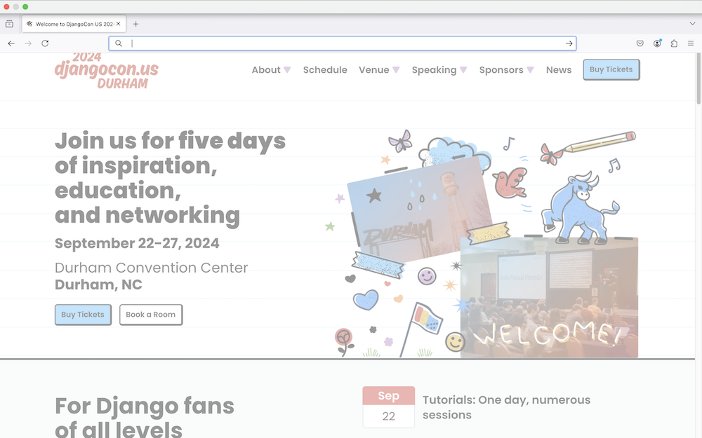

class: middle center

.small[⏳ Loading...]

---

## 👋 Hola

.left-column-66[

#### Lorenzo Peña

- 15 years of Python + Django
- From Holguín to Munich
- Django developer at Alasco


]

.right-column-33[]

---

<br/>
<br/>

# How does this URL make you feel?


--

.large[.right[😶 😬 🙄 😑 🤨 😧]]

---

class: middle center


---

class: middle center

## Whose responsibility is this?

---

class: middle center


---

class: middle center



---

layout: true
class: middle center


{{ content }}

.small.blue[Tim Berners-Lee &mdash; Cool URIs don't change, 1998]

---

It is the the duty of a **Webmaster** to allocate URIs which you will be able to stand by in 2 years, in 20 years, in 200 years. This needs thought, and organization, and commitment.
<br/>
<br/>

---

When you change a URI on your server, you can never completely tell who will have links to the old URI [...] They might have bookmarked your page. They might have scrawled the URI in the margin of a letter to a friend.

---

layout: false
class: middle center

.large[.huge[🫠]]

---

class: middle

.center.left-column[


Naming things is hard<br/>
(let alone URLs)

]

--

.center.right-column[


Named things evolve in time<br/>
(and so should URLs)

]

---

class: middle center

# Design as best as you can

### Break as less as you can

???

Reality: We should avoid not-rightful 404s
Joke: Let's return 400 instead and make everyone crazy

---

class: middle center


---

## Status codes that will help!

--

> > .code.green.big[302_FOUND]

> > .code.green.big[301_MOVED_PERMANENTLY]

--

> > .code.green.big[307_TEMPORARY_REDIRECT]

> > .code.green.big[308_PERMANENT_REDIRECT]

---

## Status codes that should have existed <br/>.small[(but don't)]

--

> > .code.green.big[309_REDIRECT_AND_REPLACE_USER_BOOKMARKS]

--

> > .code.green.big[310_RECURSION_BASE_CASE]

--

> > .code.green.big[311_NEVER_GONNA_GIVE_YOU_UP]

.right-column.right[

    

]

---

class: middle center

#### btw, why am I telling you all this?

---

class: middle center


---

class: middle center


---

class: middle center

.large[.huge[💡]]

---

layout: true

## The plan

---

.center[]

---

.center[]

---

.center[]

---

.center[]

---

layout: false
class: middle center

# The art of not redirecting

---

## Basic principles

--

.left-column.center[]

--

.right-column.center[]

---

## Readable

--

People will read them, some will even type them by memory.

<br/>

.box.what[/u/d/c/~q/page.html]
.box.nice[/user/profile]

???

- Obfuscation by design: some valid use cases

---

## Predictable

--

People should be able to guess-navigate your site by rewriting URLs.

<br/>

.box.nice[/user/profile]
.box.nice[/user/settings]
.box.nice[/user/security]

---

## Concise

--

Straight to the point, no redundancy.

<br/>

.box.what[/user/user-settings/security-settings]
.box.nice[/user/settings/security]

---

## Complete

--

Every part must lead to somewhere, or at least redirect to somewhere else.

<br/>

.box.nice[/user/settings/security]
.box.look[/user/settings]
.box.nice[/user]

---

## Consistent

--

Single language, single style.

<br/>

.box.what[/current_user/Seguridad/multi-factorAuth]
.box.nice[/current-user/security/multi-factor-auth]

---

layout: true

## Beautiful

---

---

What is beautiful?

.box.nice[/this_style/is_beautiful/]
.box.nice[/this-one/as-well]
.box.nice[/style/isReallyNotThatImportant.html]
.box.nice[\#/or-is-it?]

---

Thought, and organization and commitment will make them .bold[beautiful].

---

layout: false

.center[]

---

class: middle center

# The art of redirecting

---

## Django's provided redirects

---

## Prerequisites

--

🤓 Because we wanted to solve by code...

--

.left-column[

#### Framework

- ✅ Named URLs
- ✅ Namespaced URLs

]

--

.right-column[

#### Our code

- 😒 Keep names in sync
- ✅ Move old URLs to specific namespace

]

---

## The two parallel tracks

--

```python
urlpatterns = [
    path("", include("path.to.new.urls"),
    path("", include("path.to.old.urls", namespace="old_namespace")),
]
```

--

|            |                                                              |
| ---------- | ------------------------------------------------------------ |
| .red[old]  | `/estimating/cost_element_budgets/project/1/budget_history/` |
|            | .red[`old_namespace:budget_history`]                         |
| .blue[new] | `/costs/project/1/budget/history/`                           |
|            | .blue[`budget_history`]                                      |

---

name: code-warning
class: middle center


---

## A middleware!

--

```python
def redirect_middleware(get_response):

    def middleware(request):
        response = get_response(request)

        if go_to_new := `should_go_to_new`(request)
            return redirect(go_to_new, permanent=True)

        return response

    return middleware
```

---

## A "should go to new" function!

--

```python
def should_go_to_new(request):
    if `we_want_to_handle`(request) and `is_old_url`(request):
        try:
            return `find_new_url`(request)
        except NoReverseMatch:
            # Because it's humans keeping things in sync
            logger.warning("🚧")

    return None

```

---

## Do we want to handle?

--

```python
def we_want_to_handle(request):
    return response.status_code not in [301, 302]
```

---

## Is old URL?

--

```python
def is_old_url(request):
    resolver_match = request.resolver_match

    # Having namespaced the old URLs comes in handy now
    return "old_namespace" in resolver_match.app_names
```

---

## Find new URL!

--

```python
def find_new_url(request):
    resolver_match = request.resolver_match

    # Ah yes, view comes with all namespaces prefixed
    view_name = resolver_match.view_name.split(":")[-1]

    return reverse(
        view_name,
        args=resolver_match.args,
        kwargs=resolver_match.kwargs
    )
```

--

.box[🤔 What about query parameters?]

---

## Vanilla path

```python
path(
    "users/<int:pk>/",
    UserDetailUpdateView.as_view(),
    name="user_detail_update",
)
```

---

## Cranberry path

```python
path_with_old(
    "users/<int:pk>/",
    UserDetailUpdateView.as_view(),
    name="user_detail_update",
    old=[
        "users/<int:pk>/invite/",
        "users/<int:pk>/toggle/",
        "users/<int:pk>/revoke/",
        "users/<int:pk>/delete/",
    ],
)
```

---

layout: true

## Here we go again: "path with old"

---

```python
def path_with_old(route, view, kwargs=None, name=None, `*, old=None`):
    paths = [path(route, view, kwargs, name)]

    if name and old:
        # Redirect all "old" to "route" using "name"
        ...

    return paths[0]
```

---

```python
def path_with_old(route, view, kwargs=None, name=None, `*, old=None`):
    paths = [path(route, view, kwargs, name)]

    if name and old:
        # Redirect all "old" to "route" using "name"
        ...

    return path("", include(paths)) if len(paths) > 1 else paths[0]
```

---

```python
def path_with_old(route, view, kwargs=None, name=None, *, old=None):
    paths = [path(route, view, kwargs, name)]

    if name and old:
        redirect_view = `get_redirect_view`(name)

        for idx, old_path in enumerate(old):
            redirect_path = path(
                old_path, redirect_view,
                kwargs, f"{name}__{idx}"
            )
            paths.append(redirect_path)

    return path("", include(paths)) if len(paths) > 1 else paths[0]
```

---

layout: true

## A redirect view on-the-fly

---

---

```python
def get_redirect_view(`name`):

    def redirect_view_on_the_fly(request, *args, **kwargs):
        # Actually redirect
        ...


    return redirect_view_on_the_fly
```

---

```python
def get_redirect_view(name):

    def redirect_view_on_the_fly(request, *args, **kwargs):
        resolver_match = request.resolver_match
        resolved_namespaces = resolver_match.namespaces

        full_name = ":".join([*resolved_namespaces, name])
        return redirect(full_name, *args, **kwargs, permanent=True)

    return redirect_view_on_the_fly
```

--

.box[😉 Don't forget query parameters]

---

layout: false

## Thank you!

<br/>

.left-column-66[

| X                                                       | GitHub                                                        |
| ------------------------------------------------------- | ------------------------------------------------------------- |
| .center[] | .center[] |

.right[Slides are here 👉]
.right.small[(and this link will hopefully not break)]
]

.right-column-33[

<br/>


]

---

class: middle center


